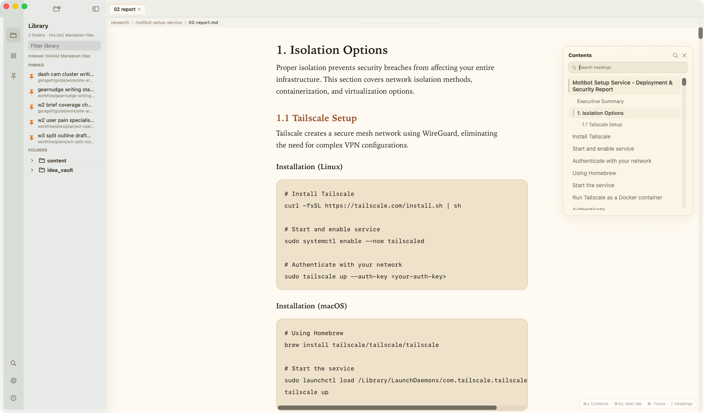

# CalmPage Native

CalmPage Native is a free macOS app for reading local Markdown files. It is built for long notes, AI-generated plans, specs, reports, and project docs that are easier to read in a calm reader than inside an editor.

This repo is the native rewrite of the earlier CalmPage app. The goal is the same: open local folders, browse Markdown files, and read them with good typography. The native version focuses more on speed, low memory use, and a macOS-style interface.



## Why it exists

AI creates more Markdown than before: plans, specs, research notes, test reports, task logs, and long documents. IDEs are good for coding, but they are often noisy for reading. Long Markdown files become easy to skip when the reading view is bad.

CalmPage exists to make local Markdown feel like a real reading space:

- quiet layout
- clear typography
- fast file browsing
- useful navigation for long documents
- keyboard-first workflow
- no cloud sync requirement

## Who it is for

- Developers reading AI-generated docs and project notes.
- Writers and builders with local Markdown folders.
- People who keep notes in files, not only in a hosted notes app.
- Anyone who wants a Markdown reader, not a full editor.

## Native rewrite target

The previous CalmPage was useful, but it carried more fixed memory cost because it used a WebView app shell. CalmPage Native keeps the workflow and moves the app shell to SwiftUI/AppKit.

Target behavior:

- great reading experience and typography
- fast startup and quick command palette
- smooth indexing without blocking the UI
- small memory footprint for large folders
- keep only current reader state in memory when possible
- store metadata, rendered output, and app state on disk
- use [`readmd`](https://github.com/peeomid/readmd) as the Markdown rendering source of truth

## Features

- Open local Markdown folders.
- Browse files in a folder tree.
- Use workspaces to keep different folder sets separate.
- Read multiple files with tabs.
- Pin important files.
- Search/open files with the command palette.
- Match rough filenames and pasted paths from terminal output.
- Use a floating table of contents for long docs.
- Search headings with `/`.
- Search inside the current document with `Cmd+F`.
- Use Vim-style reader navigation keys in the document view.
- Toggle focus mode for distraction-free reading.
- Tune theme, font size, line spacing, and reading width.
- Auto-refresh opened content when the file changes on disk.

## Design notes

CalmPage is read-first. It is not trying to replace an editor.

The UI should stay quiet and useful:

- sidebar for library, workspaces, and pins
- titlebar-level tabs to save vertical space
- subtle file path display when needed
- bottom-right shortcut hints
- floating contents panel instead of a heavy inspector panel
- native macOS behavior where it helps, custom reading theme where it matters

## Requirements

- macOS 14 or newer.
- Xcode Command Line Tools.
- Swift 6 toolchain.
- Rust, only for the Rust core tests.
- Optional: `readmd` CLI for full Markdown HTML rendering in the app.

## Install readmd

Recommended Homebrew install:

```bash
HOMEBREW_NO_REQUIRE_TAP_TRUST=1 brew install peeomid/tap/readmd
```

Cargo fallback from GitHub:

```bash
cargo install --git https://github.com/peeomid/readmd.git --force
```

Do not use `cargo install readmd`: that crates.io name belongs to another project.

After install, open CalmPage Native settings and use **Auto-detect** in the readmd renderer section.

## Build App

Build and package the macOS app bundle:

```bash
scripts/build-macos-app.sh
```

The app bundle is written to:

```text
build/CalmPage Native.app
```

Run Swift tests:

```bash
cd App
swift test
```

Run Rust core tests:

```bash
cd core
cargo test
```

## Repo Layout

- `App/`: SwiftUI/AppKit macOS app.
- `core/`: Rust scanning, indexing, and render helpers.
- `docs/`: product, design, and technical specs.
- `scripts/`: local build scripts.
- `measurements/`: performance and regression notes.

## Docs

- [Feature inventory](docs/calm-page-feature-inventory.md)
- [Architecture options](docs/lightweight-architecture-options.md)
- [Native rewrite spike plan](docs/native-rewrite-spike-plan.md)
- [Native implementation plan](docs/native-implementation-plan.md)
- [Native product spec](docs/native-product-spec.md)
- [Apple native UI design spec](docs/apple-native-ui-design-spec.md)
- [Native technical spec](docs/native-technical-spec.md)
- [Native implementation spec](docs/native-implementation-spec.md)
